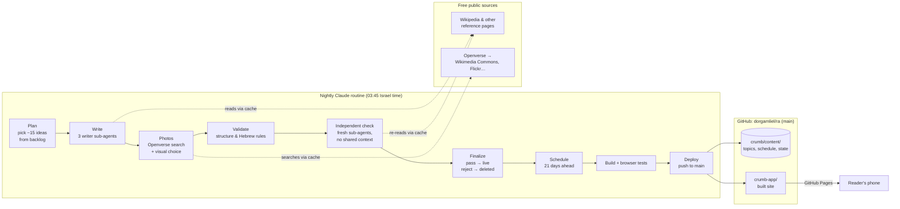
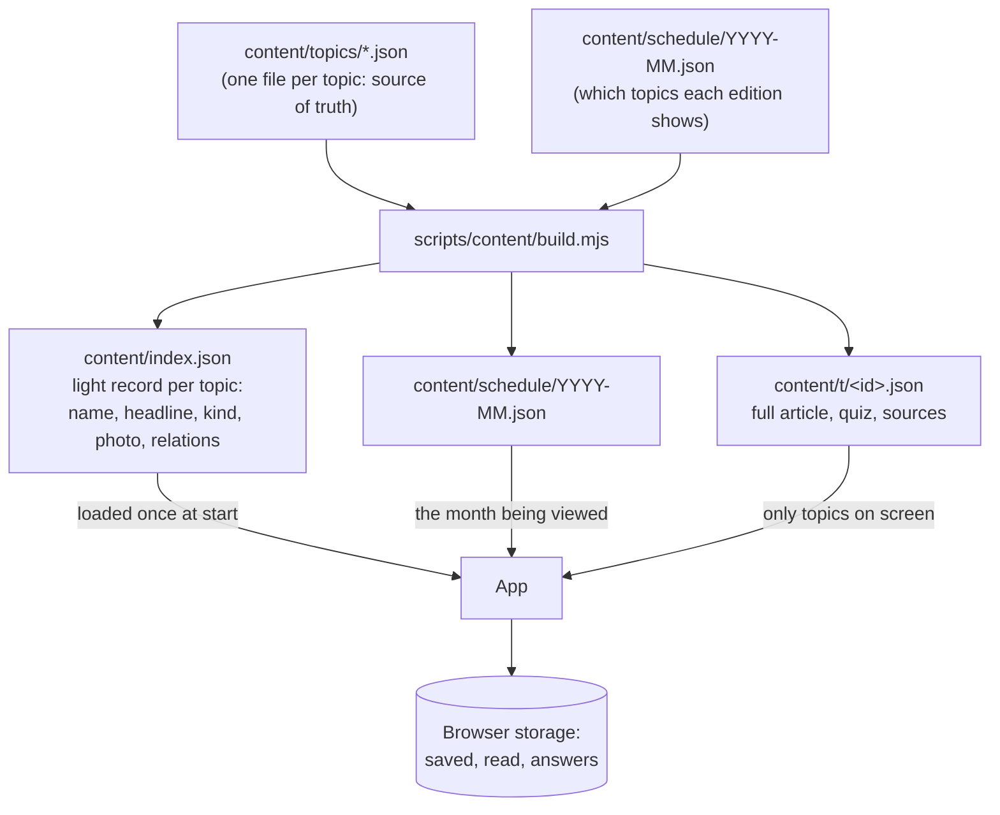
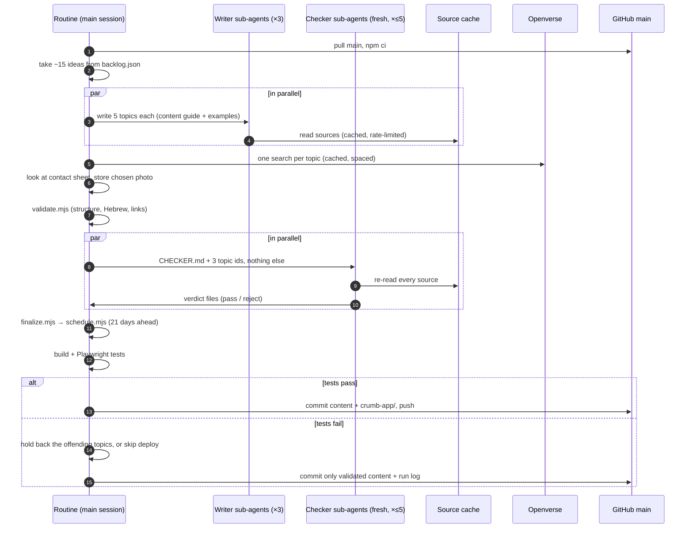

# Crumb architecture

Crumb has two halves that only meet through files in the repository:

1. **The app**: a static React site on GitHub Pages. It has no server, no keys and no AI. It
   reads content files and keeps the reader's saved items and answers in the browser.
2. **The content pipeline**: a Claude routine that runs once a night in the cloud, writes and
   checks new topics, extends the schedule, rebuilds the site, and pushes it to `main`.

Everything is free beyond your existing Claude plan: GitHub Pages hosts the site, photos come
from openly licensed archives, and the pipeline runs as a scheduled Claude session on your plan.

## The big picture



## How the app gets its content

The library is compiled into small static files, so the app never downloads everything:



- **Today** looks up the date in the month's schedule, fetches that edition's 8 topics, and lays
  them out based on what each topic offers (steps, a note, a comparison, an ingredient spotlight, a
  quiz, a matching interactive demo).
- **If a day is missing** from the schedule (say the pipeline stopped for weeks), the app builds a
  deterministic edition from the library. Readers never see an empty page.
- **Atlas** searches the index and fetches a full topic only when you open it.
- **Topics without a photo yet** get drawn artwork in their category's colors.

## One night's run, step by step



## Why nothing blocks

| What can go wrong | What happens |
|---|---|
| A writer sub-agent fails | The run continues with the topics that exist. |
| A source is down or rate-limited | The writer picks another source or drops the claim; the checker treats unverifiable claims as problems. |
| Photo search is rate-limited | The photo step stops for the night. Topics go live with drawn artwork and get a photo in a later run. |
| A topic fails validation twice | It is deleted and its idea goes back to the end of the backlog. |
| The checker rejects a topic | It is deleted, and the reason is logged in `content/state/rejected.json`. |
| The checker never ran on a topic | It stays a draft. Drafts are never built or scheduled; the next run checks them. |
| Tests fail | Offending topics are held back; if the cause is unclear, nothing is deployed. The site keeps serving the last good build, which already has three weeks of scheduled editions. |
| The routine doesn't run at all | The schedule runs three weeks ahead; after that the app's deterministic fallback keeps serving editions from the library. |

## Staying under rate limits (and free)

- **One download per page.** `source.mjs` caches every page it reads, so the writer and the checker
  share one fetch. Reachable URLs are recorded in `content/state/sources.json`.
- **One search per query, ever.** `image.mjs` stores search results in
  `content/state/image-search-cache.json` (committed) and downloads each chosen photo once.
- **Polite spacing.** Each host gets a minimum interval between requests (4s for Openverse, 1.5s
  for Wikimedia) and exponential backoff on 429/5xx, then gives up for the night (exit code 3).
- **Small batches.** About 15 topics a night is roughly 15 photo searches and 30–60 page reads.
- **Static hosting.** Readers never touch an API; they only load files from GitHub Pages.

## Scale

| | Per night | Per year |
|---|---|---|
| New topics | ~15 | ~5,000 |
| Topics shown | 24 (3 editions × 8) | about 8,800 placements |

A topic is not shown again for 45 days while there are fresher ones. As the library grows past a
few thousand topics, editions effectively stop repeating. The index grows ~400 bytes per topic,
about 2 MB (~500 KB compressed) after a year. If it ever gets heavy, it can be split by category
without changing the app's design.

## Where things live

```text
crumb/
  content/
    topics/<id>.json          source of truth, one topic per file
    schedule/YYYY-MM.json     editions per day (past days never change)
    titles.json               edition titles and subtitles per daypart
    state/backlog.json        ideas waiting to be written
    state/rejected.json       topics the checker rejected, with reasons
    state/image-search-cache.json, sources.json   caches that keep us under rate limits
    state/runs/<date>.md      one short log per nightly run
  pipeline/
    PLAYBOOK.md               what the nightly routine does, step by step
    CONTENT-GUIDE.md          rules for writing a topic
    CHECKER.md                brief for the independent checker
  scripts/content/            build, validate, schedule, image, source, finalize
  src/                        the app (React + TypeScript + Vite)
  docs/ARCHITECTURE.md        this file
crumb-app/                    the built site GitHub Pages serves
```

## Limits worth knowing

- The checker is an AI reviewing AI-written text against real sources. It catches most errors but
  not all; articles say "נבדק אוטומטית", never "verified".
- Photo quality depends on what open archives have; some topics will keep their drawn artwork.
- Each nightly run uses some of your Claude plan's capacity. If a run hits a usage limit, it simply
  does less that night.
